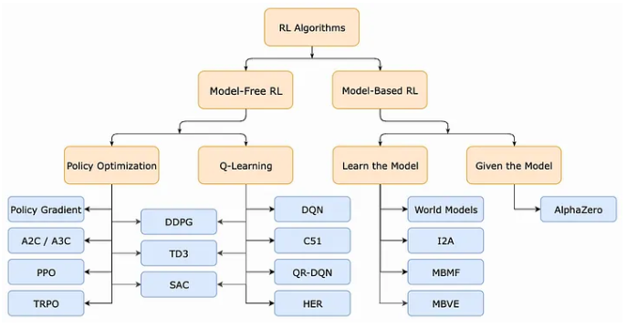
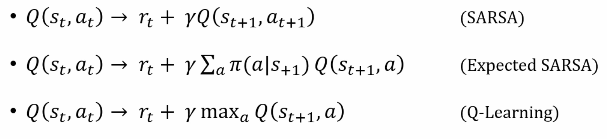
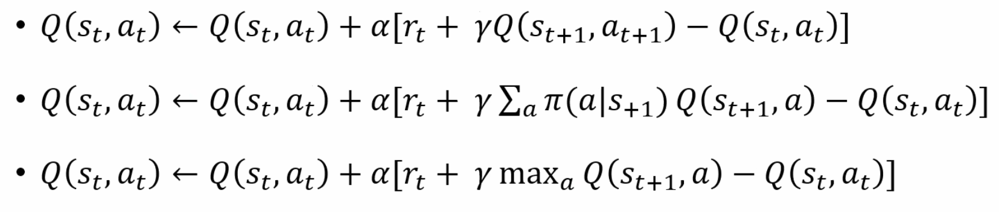
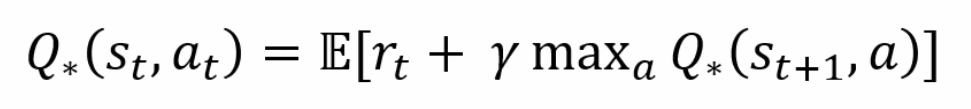
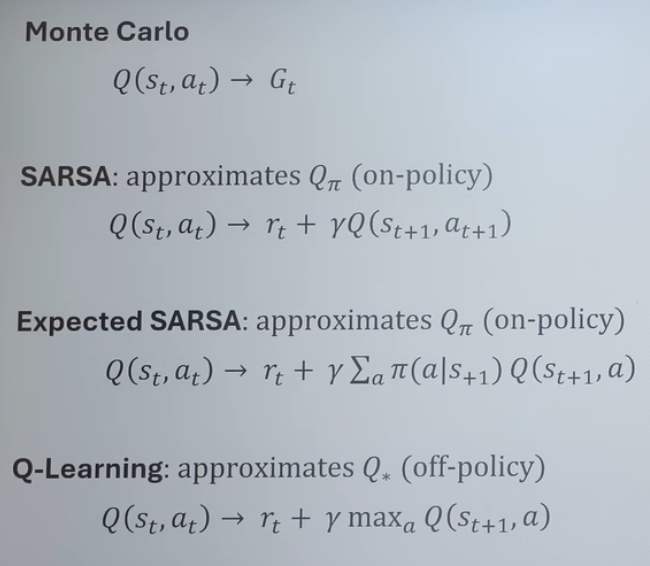

# Reinforcement Learning  
- Agent: Can directly control.  
- Environment: Cannot directly control, interact through agent.  
They interact via "Action" and "State". Agent interacts with Env is "Action", the other way around is "State".  
```bash
[ AGENT ] -- action --> [ ENV ]
[ AGENT ] <-- state --- [ ENV ]

[ Brain ] -- motor ouput --> [ Limps ]
[ Brain ] <-- sensory input --- [ Senses ]
[ Computer ] -- action --> [ Limps ], Action: motor speed, direction, video game ability, etc
[ Computer ] <-- state --- [ Senses ], State: position, veloctiy, pixel colours, temperature, battery level, etc.
```
Reward is introduced after each action to represent if the action have a good or bad outcome.  
```bash
[ AGENT ] -- action --> [ ENV ]
[ AGENT ] <-- state --- [ ENV ]
[ AGENT ] <-- reward --- [ ENV ]
```
  
## Markov Decision Process (MDP)  
- A sequence of "State, Action, Reward": S0,A0,R0,S1,A1,R1,S2,A2,R2...  
- Other sources may state: S0,A0,R1,S1,A1,R2,S2,A2,R3...  , which will cause formulas to be different.  
- Using "S0,A0,R0,S1,A1,R1,S2,A2,R2...", formulas will be in R(t), whereas using "S0,A0,R1,S1,A1,R2,S2,A2,R3...", formulas will be R(t+1).  
---
Markov Property - Each state is only dependent on immediately previous states.
  
Policy denoted by π, s -> a, at each timestep t, use the input state to decide on the output action that maximises the reward.  
Policy π(a∣s) = probability. Given same state, policy can produce a range of random motions each with their own probability.  
Return G, where can be G1,G2,G3,...  
Discount Factor γ, 0 ≤ γ ≤ 1, lower to make rewards in the future less significant, as future harder to predict.  
This makes return Gt = Rt + γR(t+1) + γ²R(t+2) + γ³R(t+3) + ...  
  
Therefore, goal is to find the policy that maximises return.  
  
## Key Concepts
- exploration/exploitation tradeoff  
- temporal difference  
- the credit assignment problem  
- world models  
- sample efficiency  
- policy gradient method  
- value function: keep track of average return G expected when following a certain policy in a certain state or state + action.  
  
---  
- Exploration/Exploitation Tradeoff:  
An agent often has to decide between:  
Exploitation: Using what it already knows to get the best reward.  
Exploration: Trying new actions to discover potentially better rewards in the future.  
  
- Temporal Difference:  
A method for updating value estimates using the difference between predicted rewards and actually received rewards in the next step.  
V(s) ← V(s)+ α(r+ γV(s′) − V(s)), α = learning rate.  
Example: You expect 10 points from being in a state, but after taking an action, you get 12 points. TD uses this difference (2 points) to adjust your estimate.  
  
- The Credit Assignment Problem:  
What it is: In RL, when a reward is delayed, it’s hard to know which actions actually caused it.  
Example: You win a chess game after 40 moves. Which of your moves really mattered for winning? That’s the credit assignment problem.  
Why it matters: Solving this helps the agent learn which actions are actually useful.  
  
- World Model:  
An agent's internal, learned simulation of its environment, allowing it to predict future states and rewards from current states and actions without actually trying them.  
WM(s_{t},a_{t})---> (s_{t+1}, r_{t}). Given a chosen action and state, what reward and next state will it lead to?  
  
- Sample Efficiency:  
How well an RL algorithm learns from a limited number of interactions with the environment.  
  
- Policy Gradient Method:  
A type of RL method that directly adjusts the policy (the probability of taking actions) to maximize expected reward.  
Example:  
Policy = “In this state, take action A 70% of the time, action B 30%.”  
Policy gradient tweaks these probabilities based on which actions lead to higher rewards.  

- Value Function:  
A function that estimates the expected total reward you’ll get starting from a state (or state-action pair) and following a policy.  
Types:  
State value 𝑉(𝑠): Expected return from state s following a policy.  
Action value Q(s,a): Expected return from taking action a in state s and then following a policy.  
Best case denoted with *.  
Example:  
If you’re at the start of a maze, V(start)=50 points means that following your current strategy, you expect to collect 50 points on average.  
Normal RL, value functions are deterministic (not random).  
Bayesian RL & distributional RL, consider randomness/variance/risk in value functions.  
---  
The goal of a reinforcement learning task is to find a policy that accumulates a lot of rewards over the long run. We want to find an optimal policy π*, which is a policy that achieves the highest possible expected return for all states. It turns out optimal policies π* can be defined by their value functions:  
Optimal State-Value Function: v*  
Optimal Action-Value Function: q*  
  
### Generalized Policy Iteration (GPI)  
Almost all RL methods adhere to the GPI paradigm. Policy iteration is a method to find the optimal policy by iteratively doing two general steps:  
Policy Evaluation (E): We learn the value function under the current policy.  
Policy Improvement (I): We use the evaluated value function to create a slightly improved policy.  
GPI refers to the general idea of letting a policy π and a value function v improve upon each other iteratively until there is not much improvement to be made.  
  
### Different RL Approaches  
- Model-based vs. Model-free  
Model-based methods: The agent has access to, or learns, a model of the environment and then uses this model to make decisions. A model of the environment refers to a function that can predict state transitions and rewards.  
Model-free methods: The agent learns directly from experience or trial-and-error and uses the feedback to update their internal policies or value functions.  
  
- Policy-based vs Value-based  
Policy-based methods: The agent learns the policy directly.  
Value-based methods: The agent learns a value function that gives the expected return of being in a given state or performing a given action in a given state. The policy can then be derived from the learned value function.  
  
- On-policy vs. Off-policy methods
In RL, the agent generates experience by interacting with the environment under a certain policy and then learns the policy from those experiences.  
On-policy methods: The agent attempts to learn the policy that is also used to generate the experience.  
Off-policy methods: The agent learns a policy that is different from the one used to generate experiences.  
  
### Monte Carlo to policy gradient  
It is a broad class of computer algorithms that rely on repeated random sampling to obtain numerical results.  
  
epsilon - maintains a balance between exploration and exploitation. Proportion of time that actions are picked randomly, decreases over time as policy improves and less exploration is needed.  
  
On-policy - Behaviour policy = Target Policy  
On-policy MC uses an ε-soft policy. A soft policy refers to any policy that has a small, but finite, probability of selecting any possible action, ensuring exploration of alternative actions.  
- After each episode, the observed returns are used to learn the action-value function, and then the policy is improved based on the learned value function for all the states visited in the episode.  
- In on-policy MC, our policy plays two roles: generating trajectories through exploration and learning the optimal policy. On-policy MC is a compromise as it learns action values not for the optimal policy, but from a near-optimal policy that still explores.  
  
Off-policy - Behaviour policy not the same as target policy  
Off-policy MC uses two policies: one for learning the optimal policy, called the target policy, and the other for exploration and generating trajectories, called the behavior policy. It follows the behavior policy while learning about and improving the target policy.  
- Off-policy MC uses policy b, which can be any ε-soft policies, as the behavior policy, to explore and generate trajectories. Note that we wish to estimate the expected returns under the target policy π, but all we have are returns from the behavior policy b, which gives us the wrong expectation. Through importance sampling, we can estimate expected values under one distribution given samples from another.  
- The algorithm uses weighted importance sampling, which calculates a weighted average of returns according to the relative probability of their trajectories occurring under the target and behavior policies.  
  
With Monte Carlo methods, one must wait until the end of an episode before updating values. If episodes are long, learning can become slow.  
Faces difficulty identifying one wrong or right move within, resulting in credit assignment problem.  
  
### Temporal Difference  
Solves credit assignment problem. Tackles with action by action basis rather than episode by episode basis.  
  
Noting return is Gt = Rt + γR(t+1) + γ²R(t+2) + γ³R(t+3) + ... 
which is also Gt = Rt + γG(t+1)  
  
Monte Carlo - Given any state and action, monte carlo tells the return.  
SARSA - Tells how much better or worse is return, relative to new state and the action ended up taken. (On-policy TD)  
Expected SARSA - Tells how much better or worse is return, relative to new state and all of its actions averaged out according to policy probability. (On-policy TD)  
Q learning - Tells how much better or worse is return, relative to new state with its best case scenario highest estimated action.(Off-policy TD)(Most Sample efficient)  
  
  
### Bellman Optimality Equation  
  
Principle of optimality: An Optimal policy has the property that whatever the initial state and the initial decision are, the remaining decisions must constitute an optimal policy with regard to the state resulting from the first decision.  
  
With the Bellman optimality equation for q*, it is even easier to determine the optimal policy π*, since for each state s, one can simply find any action that maximizes q*(s, a).  
  
Explicitly solving the Bellman optimality equation is one way of finding an optimal policy, but it is rarely practical since it requires an exhaustive search of all possibilities, computing their probabilities of occurrence and their desirabilities in terms of expected rewards. Most methods approximate solving the Bellman optimality equation using experienced transitions instead of knowledge of the expected transitions.  
  
---
   
  
### Deep Q Networks  
```bash
Advatanges of Neural Network is to go from:
[ Discrete states ] ---> [ Continuous states ]
[ Discrete actions ] ---> [ Continuous actions ]
```
In Deep Q Networks, it uses only [ Discrete states ] ---> [ Continuous states ]  
Swap out Qlearning table with Qlearning with neural network. This means have to train a neural network.  
How to train neural network -  backpropagation, gradient descent, etc.  
  
- DQN uses a Q-network to approximate the Q-values for each possible action, alongside a replay memory D for experience replay.  
- Experience replay stores each step of the experience into the replay memory. This memory can then later be used for multiple weight updates.  
- During training, it selects a random minibatch of sample transitions from the replay memory for Q-learning updates.  
- Actions are selected using an ε-greedy policy, which balances exploration and exploitation.  
Experience replay with random minibatch allows for greater data efficiency and it breaks the strong correlations between the samples and therefore reduces the variance of the updates. DQN is considered an off-policy method since it learns from sample transitions generated by older policies.  
  
### Double Deep Q-learning (Double DQN)
Deep Q-learning suffers from maximization bias as it uses the same values both to select and evaluate an action. The issue is addressed by applying the principles of double Q-learning, which uses a separate target action-value function to estimate target values. It separates the max operator in the target into two parts: action selection and action evaluation.  
  
- Double DQN uses two networks: the online network Q for policy evaluation and action selection, and a target network Q^ to estimate the target value.  
- During the Q-update, the target network Q^ is used to estimate the target value.  
- The target network weights are periodically (every C steps) updated with the weights from the online network. This periodic update ensures that the target values gradually adjust to reflect the latest policy while maintaining enough stability to reduce overestimations.  
  
### Policy Gradient
Policy gradient (PG) methods directly model and optimize a parameterized policy function (e.g., using a neural network) rather than an action-value function (Q-function). The goal is to adjust the policy's parameters via gradient ascent to maximize the expected cumulative reward.  
  
### Neural Science
Dopamine comes with the earliest sign of reward.  
  
~ Relating to RL,  
Dopamine ~ Temporal Difference  
Dorsolateral striatum ~ action selection and execution (Actor)   
Ventral striatum ~ evaluation and prediction (Critic)  
The Actor: Learns the Policy. It's the "Muscle. "The Critic: Learns the Value. It's the "Coach."  

### Grid Example
Problem: In a 2D Plane, cross over the wall and reach the goal by moving up, down, left or right. Terminate when 20 steps or reach the goal.  
Firstly,  
Define State, Action, Reward.  
- State: X,Y coords.  
- Action: up, down, left or right denoted by numbers.  
- Reward: 0 if in target cell, -1 otherwise.  

## Links
Resources:  
Reinforcement Learning: An Introduction (textbook) - http://incompleteideas.net/book/the-b...  
OpenAI Spinning Up website - https://spinningup.openai.com/en/late...  
RL subreddit -   / reinforcementlearning    
  
Articles:  
Deep Reinforcement Learning Doesn't Work Yet - https://www.alexirpan.com/2018/02/14/...  
Article about monkey experiments (temporal difference & dopamine) - https://doi.org/10.1126/science.275.5...  
2008 article about actor-critic and the striatum - https://doi.org/10.3389/neuro.01.014....  
  
Cool algorithms/papers:  
MuZero - https://deepmind.google/discover/blog...  
DreamerV3 - https://danijar.com/project/dreamerv3/  
Robot ball-in-a-cup - https://ieeexplore.ieee.org/abstract/...  
Inverse Q-Learning - https://div99.github.io/IQ-Learn/  
  
---
# Inverse Reinforcement Learning
Learn reward function from expert's trajectories of states and actions, and then learn policy from that.  
Learn underlying goals instead of mimicking behaviour directly.  
  
---
# Imitation Learning
Learn policy from expert's trajectories without reward signals.  
Behavioural cloning.  
Dataset aggregation (DAGGER): Generate mistakes on purpose and humans corrects them.  